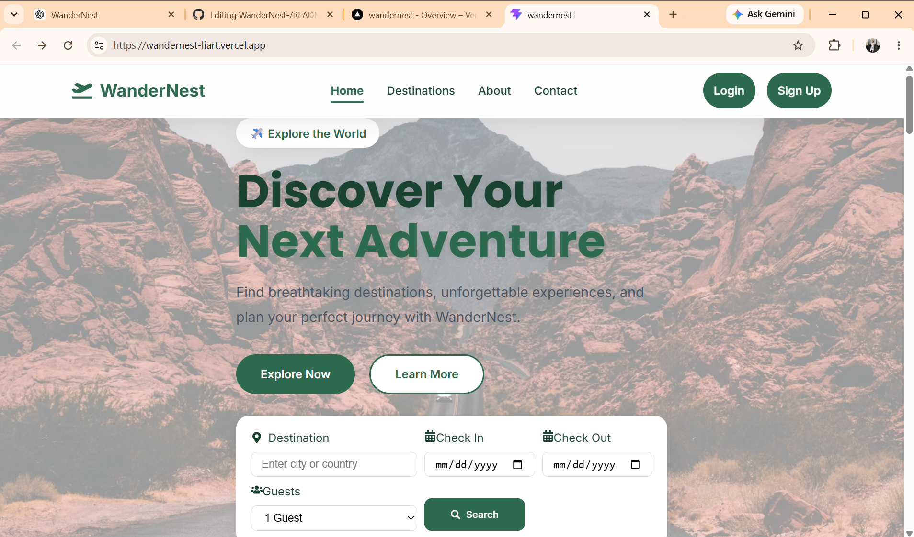
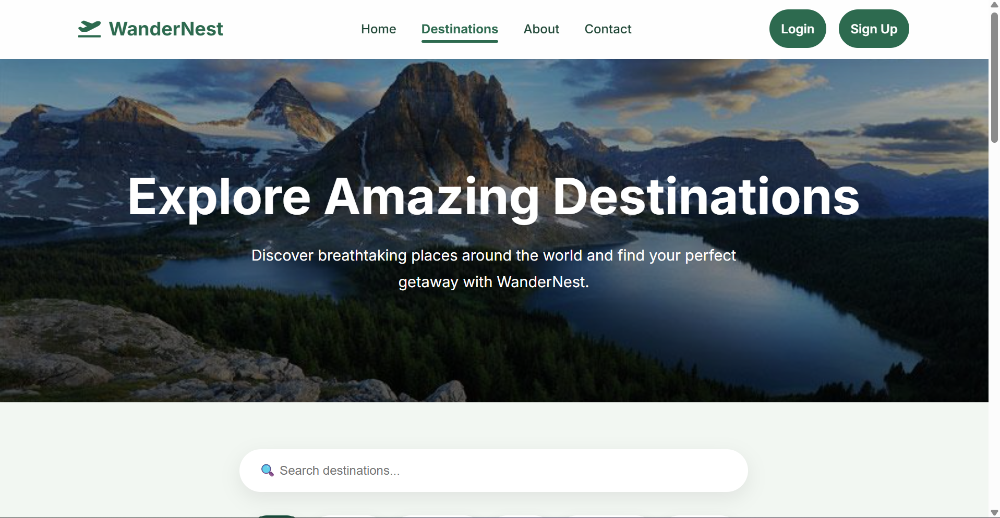
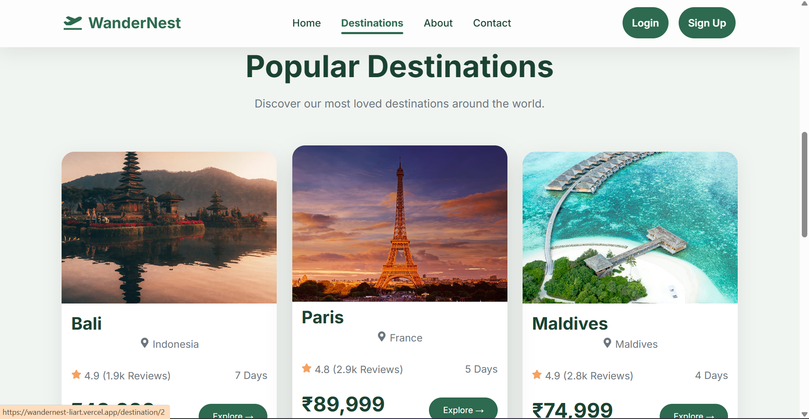
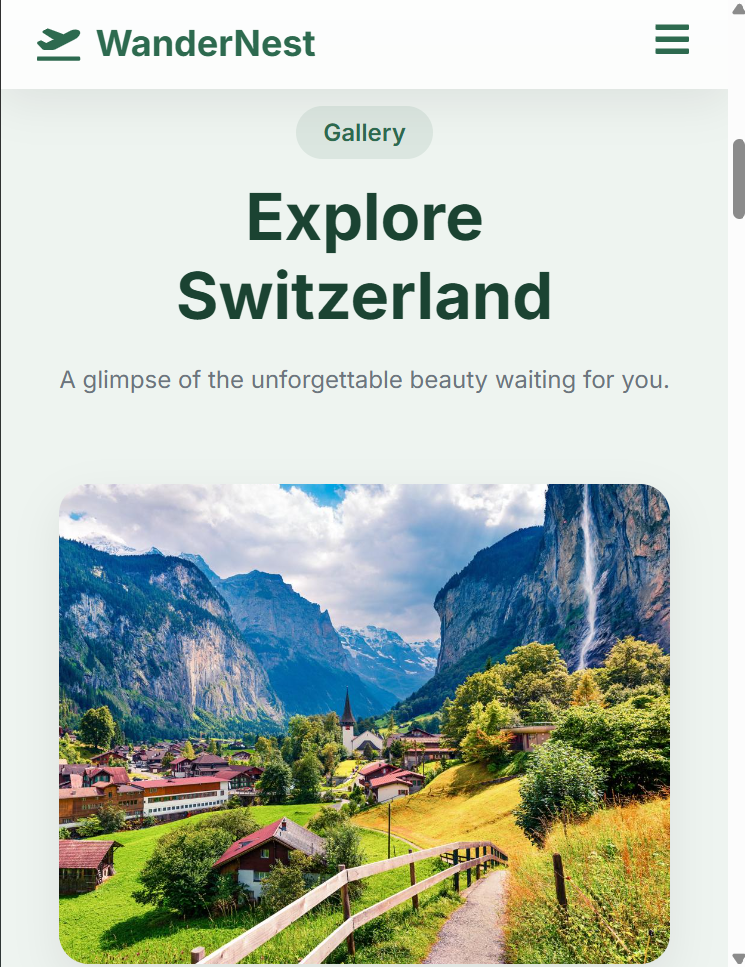

<div align="center">

# 🌍 WanderNest

### Explore • Discover • Experience

A modern, responsive travel website built with **React.js** and **Vite**, designed to help users explore beautiful destinations through an elegant and interactive user experience.

<p>
  <a href="https://wandernest-liart.vercel.app/" target="_blank">
    
  </a>
  <a href="https://github.com/Devika-Subhash/WanderNest" target="_blank">
    
  </a>
</p>


</div>

---

# 📖 Overview

**WanderNest** is a modern travel website that enables users to discover destinations around the world through a clean, responsive, and engaging interface.

The application focuses on creating a premium user experience with reusable React components, dynamic routing, destination exploration, and responsive layouts that work seamlessly across desktop, tablet, and mobile devices.

---

# ✨ Features

### 🌍 Travel Destinations
- Explore popular travel destinations
- Beautiful destination cards
- Detailed destination information
- High-quality image galleries

### 🔍 Smart Search
- Search destinations instantly
- Category-based filtering
- Easy destination discovery

### 📍 Destination Details
- Hero section
- Destination overview
- Highlights & features
- Travel gallery
- Included services
- Call-to-action booking section

### 👤 User Interface
- Login page
- Signup page
- About page
- Contact page
- Responsive navigation

### 🎨 UI/UX
- Modern design
- Fully responsive layout
- Smooth hover animations
- Reusable components
- Clean typography
- Premium travel-inspired interface

---

# 🛠️ Tech Stack

| Technology | Purpose |
|------------|---------|
| React.js | Frontend Library |
| Vite | Build Tool |
| React Router DOM | Client-side Routing |
| JavaScript (ES6+) | Programming Language |
| HTML5 | Structure |
| CSS3 | Styling |
| Git | Version Control |
| GitHub | Repository Hosting |
| Vercel | Deployment |

---

# 📂 Project Structure

```text
WanderNest/
│
├── public/
│
├── src/
│   ├── assets/
│   │   └── images/
│   │
│   ├── components/
│   │
│   ├── data/
│   │
│   ├── pages/
│   │
│   ├── App.jsx
│   └── main.jsx
│
├── package.json
├── vite.config.js
└── README.md
```

---
# 📸 Screenshots

## 🏠 Home Page



---

## 🌍 Destinations



## 🔥 Popular  Destinations


---

## 📱 Mobile View



---

# 🚀 Live Demo

🌐 **Website**

https://wandernest-liart.vercel.app/

---

# 💻 Installation

Clone the repository

```bash
git clone https://github.com/Devika-Subhash/WanderNest.git
```

Navigate to the project

```bash
cd WanderNest
```

Install dependencies

```bash
npm install
```

Run locally

```bash
npm run dev
```

Build production version

```bash
npm run build
```

Preview production build

```bash
npm run preview
```

---

# 🎯 Future Enhancements

- ❤️ Wishlist functionality
- 👤 User authentication
- 📅 Online booking
- 💳 Payment gateway integration
- ⭐ User reviews
- 🗺️ Interactive maps
- 🤖 AI-powered travel recommendations
- 🌐 Multi-language support

---

# 📚 Learning Outcomes

This project helped strengthen my understanding of:

- React Component Architecture
- React Router DOM
- Reusable Components
- Responsive Web Design
- CSS Grid & Flexbox
- State Management
- Modern UI Design
- Git & GitHub Workflow
- Production Deployment with Vercel

---

# 🌟 Show Your Support

If you found this project helpful or interesting:

⭐ Star this repository

🍴 Fork the project

📢 Share your feedback

---


<div align="center">

### ✈️ Wander the world, one destination at a time.

**Made with ❤️ using React & Vite**

</div>
